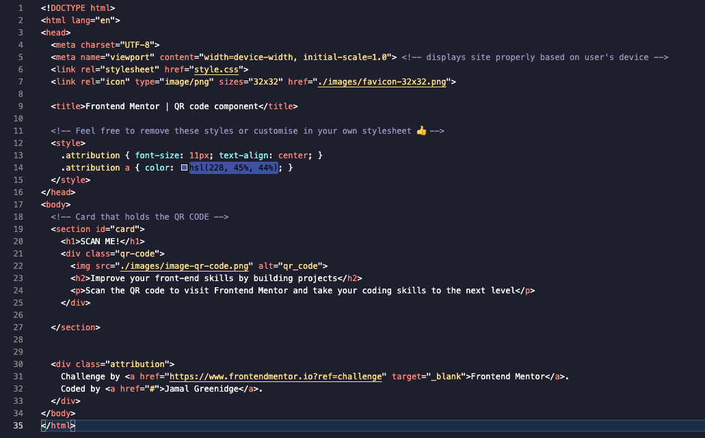
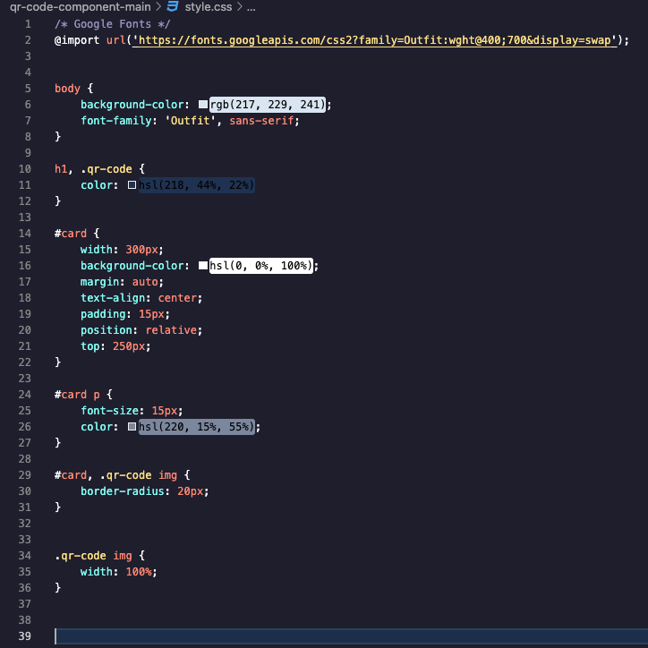

# Frontend Mentor - QR code component

This is a solution to the [QR code component challenge on Frontend Mentor](https://www.frontendmentor.io/challenges/qr-code-component-iux_sIO_H). Frontend Mentor challenges help you improve your coding skills by building realistic projects. 

## Table of contents

- [Overview](#overview)
  - [Screenshot](#screenshot)
  - [Links](#links)
- [My process](#my-process)
  - [Built with](#built-with)
  - [What I learned](#what-i-learned)
  - [Continued development](#continued-development)
  - [Useful resources](#useful-resources)
- [Author](#author)

**Note: Delete this note and update the table of contents based on what sections you keep.**

## Overview

### Screenshots





### Links

- Solution URL: [Solution](https://github.com/MalGreenidge/qr_code_challenge/blob/main/style.css)
- Live Site URL: [Live Site: ](https://malgreenidge.github.io/qr_code_challenge/)

## My process

### Built with

- Semantic HTML5 markup
- CSS custom properties
- CSS Positioning
- Reactive Design

### What I learned

This challenge was a great learning experience that allowed me to put what I learned into action. I initally attempted to position the QR Code using flexbox. I completed it using CSS positioning. 

To see how you can add code snippets, see below:

```html
<h1>Some CSS code I'm proud of</h1>
```
```css

#card {
    width: 300px;
    background-color: hsl(0, 0%, 100%);
    margin: auto;
    text-align: center;
    padding: 15px;
    position: relative;
    top: 250px;
}
```

### Continued development

In upcoming projects I want to focus more on positioning elements using Flexbox and CSS grid. This would be a more optimal approach.

### Useful resources
- [FreecCodeCamo](https://www.freecodecamp.org/) 
- [CodeCademy](https://www.codecademy.com/learn)

## Author

- Website - [Jamal Greennidge](https://github.com/MalGreenidge)
- Frontend Mentor - [@MalGreenidge](https://www.frontendmentor.io/profile/yourusername)
- Twitter - [@MalGreenidge](https://www.twitter.com/MalGreenidge)

